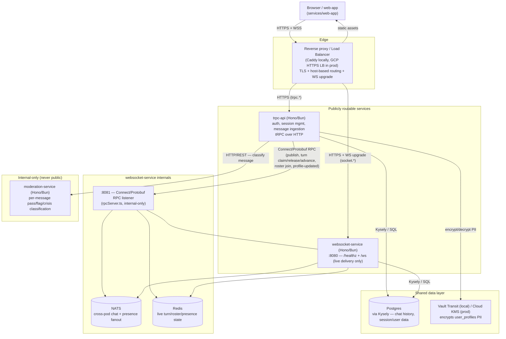

# Architecture

This is the source of truth for how backend services in this repo are
built — the goal is a codebase that stays coherent across many separate
feature-development sessions, not just internally consistent within one.
A PR that violates this document is a bug, not a trade-off to negotiate —
same framing as `CHARTER.md` for product decisions.

Scope: `services/trpc-api`, `services/websocket-service`,
`services/moderation-service`, and anything added under `packages/`. Not
`services/web-app` (frontend has its own conventions).

## System overview

A high-level view of every service in the system and how they're wired
together — for onboarding and as a map back to the sections below. Not
scoped to backend-only like the rest of this document: the client is
included because "how the system is wired" isn't answerable without it.
Reflects what the code actually does today, not `docs/tech_spec.md`'s
target cloud topology where the two differ (e.g. that document specs
trpc-api → moderation-service as gRPC; the current implementation is
plain HTTP/REST — `adapters/moderationServiceAdapter.ts`).



- **Client → Edge**: one persistent WebSocket connection per signed-in
  session (not opened/closed per circle) plus REST/RPC calls for
  everything else — see `docs/tech_spec.md` §3.
- **trpc-api → moderation-service**: every inbound message is classified
  before persistence or delivery — see
  `services/trpc-api/src/services/messageService.ts`.
  `moderation-service` has no public ingress, matching its own
  `docker-compose.yml` entry (no host `ports:` mapping).
- **trpc-api → websocket-service**: the internal RPC surface this
  document's "Internal service-to-service calls" section below covers —
  a second, internal-only port (`:8081`), never the same port as the
  public `/healthz` + `/ws` listener (`:8080`).
- **NATS / Redis**: both internal to websocket-service only — nothing
  else in the system ever connects to them directly. See
  `.agents/skills/nats-vs-redis/SKILL.md` for what each is for.
- **Postgres**: the only piece of durable storage, reached independently
  by trpc-api and websocket-service (never by the browser directly, and
  never by moderation-service).

## Layering: Clean Architecture, unidirectional

```
Controller → Service → Repository/Adapter
```

Dependencies point one way only.

- **Controller** — the framework-facing edge. For `trpc-api`, this is a
  tRPC router/procedure (`src/controllers/`): parse input (zod), call one
  Service function, shape the response. No Kysely queries, no raw
  `fetch`, no business logic here. For `websocket-service` and
  `moderation-service`, this is the Hono route handler.
- **Service** (`src/services/`) — business logic. Framework-agnostic: it
  must never import a Hono `Context`, a tRPC-specific type, or anything
  else tied to the transport. Dependencies (repositories, adapters) are
  passed in as plain function parameters — no class hierarchy, no DI
  container.
- **Repository / Adapter** (`src/repositories/`, `src/adapters/`) — the
  only place that talks to the outside world. `repositories/` = database
  access (Kysely). `adapters/` = everything else external (HTTP calls to
  another service, Redis, NATS). No business logic here either — just
  the mechanics of the call.

A service with no real logic yet (the current state of
`websocket-service` and `moderation-service`) doesn't need invented
Service/Repository layers — don't scaffold layers for logic that doesn't
exist. Add them when the logic does.

## Framework: Hono, on Bun

Every backend service is a Hono app served via `Bun.serve({ fetch:
app.fetch })`. `trpc-api` mounts its tRPC router onto Hono using
`@hono/trpc-server`'s `trpcServer` middleware rather than tRPC's
standalone adapter.

Known caveat: `@hono/trpc-server` has had a reported type-compatibility
issue against `@trpc/server@11.4.x` (worked around at the time by pinning
`@trpc/server` to `11.3.1`). Pin deliberately and confirm `bun run
typecheck` is clean before bumping either package — don't assume the
latest of both together just works.

## Data access: Kysely only

Kysely is the only way any service talks to Postgres — no raw `pg.Pool`
queries outside of Kysely's own `PostgresDialect` setup in
`packages/shared`. Driver is plain `pg` (pure JS) — **never add
`pg-native`**, it doesn't work on Bun.

Migrations are Kysely-native TypeScript files (`up`/`down` exports) under
`packages/shared/migrations/`, not hand-rolled SQL plus a custom runner.
Raw SQL is still fine *inside* a migration via Kysely's `sql` template
tag when the schema builder doesn't cover something — the constraint is
the migration format, not a ban on SQL.

## TDD and coverage

Tests are written before the implementation for every new Service,
Repository, and Adapter. Target is 100% line/function coverage, enforced
via `bun test --coverage` and a `coverageThreshold` in the root
`bunfig.toml`. Where full coverage genuinely isn't reachable (e.g. a
defensive branch that can't be triggered), that's flagged and discussed
in review — it is not silently waived, and there is no ignore-comment
mechanism to lean on.

Note: Bun enforces `coverageThreshold` per file, not in aggregate, and
there's no per-file override — so the configured floor in `bunfig.toml`
necessarily sits at or below the lowest currently-justified file (see
that file's comment for why the threshold is where it is). That floor is
a tooling limitation, not license for a new file to ship undertested —
full coverage on new code is still a review-time check.

## Testing constraints

- **Mock only at the Adapter/Repository boundary.** A Service's unit
  tests inject fake Repository/Adapter implementations and assert on the
  Service's own logic. Never mock a Service directly — if a test needs
  to fake behavior above the Repository/Adapter layer, that's a sign the
  boundary is in the wrong place.
- **Integration tests use idempotent seeding.** Anything that hits the
  real Postgres/Redis/NATS from `docker-compose` must be safe to re-run
  without unique-constraint failures — fixed seed IDs with `ON CONFLICT
  DO NOTHING`, or truncate-then-seed. A test suite that only passes once
  per fresh database is a bug in the test, not an acceptable integration
  test.

## Internal service-to-service calls: Connect (Protobuf), not REST

trpc-api's calls into websocket-service (`services/trpc-api/src/adapters/websocketServiceAdapter.ts`
→ `services/websocket-service/src/rpcServer.ts`) use
[Connect](https://connectrpc.com/) (`@connectrpc/connect`), schema-defined
in `packages/proto` and code-generated via `buf`/`protoc-gen-es`
(`bun run generate` in that package; output is committed, not generated
at container start — same spirit as this repo's hand-committed Kysely
migrations). Any new internal, service-to-service call follows this
pattern, not a hand-rolled `fetch` + JSON REST route.

Real gRPC-over-HTTP/2 (`@grpc/grpc-js`) was deliberately not used: Bun's
`node:http2` server support (added in 1.2) has an open correctness bug
(oven-sh/bun#21759) with malformed trailers, and every internal call
today is unary anyway. Connect's own protocol (Protobuf/JSON over plain
HTTP/1.1) gets the same typed-contract/codegen/binary-wire-format
benefits without depending on that, while staying upgradable to real
gRPC later with no handler changes if that's ever needed (streaming, a
strict HTTP/2-only proxy in front).

Each such internal RPC surface runs on its own port, **never published to
the host** (`docker-compose.yml` — same posture as `moderation-service`,
which is never public either), separate from whatever public port that
service's own `Bun.serve`/Hono app owns — a single `Bun.serve` can't own
two ports, so a second RPC listener (Fastify + `@connectrpc/connect-fastify`
on the server side, since Fastify's Bun compatibility for this is
verified — see `rpcServer.ts`) is how a service exposes both.

## DRY / KISS / Functional

These are stated in full in `docs/tech_spec.md` Section 10 — this
document doesn't restate them, it enforces them structurally: the
layering above is what makes "shared logic lives in one place" and "pure
functions, no hidden side effects" checkable rather than aspirational.
